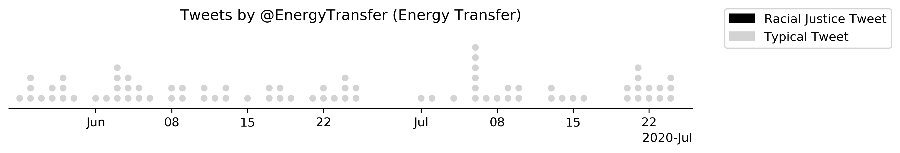
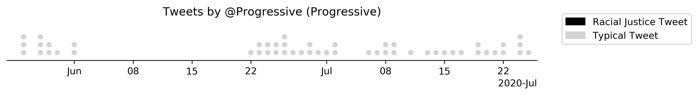
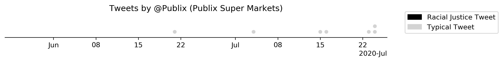
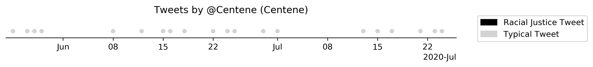
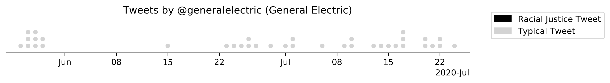

## Silent companies

### List

There were 19 corporations that did not tweet about the protests: <sup>[1](#1)</sup>

| Corporation | Sector |
| --- | --- |
|Raytheon Technologies|Aerospace & Defense|
|Boeing|Aerospace & Defense|
|Lockheed Martin|Aerospace & Defense|
|Northrop Grumman|Aerospace & Defense|
|General Dynamics|Aerospace & Defense|
|Phillips 66|Energy|
|Valero Energy|Energy|
|Exxon Mobil|Energy|
|Energy Transfer|Energy|
|New York Life Insurance|Financials|
|StoneX|Financials|
|Progressive|Financials|
|Publix Super Markets|Food & Drug Stores|
|Centene|Health Care|
|General Electric|Industrials|
|Ford Motor|Motor Vehicles & Parts|
|Best Buy|Retailing|
|Oracle|Technology|
|Charter Communications|Telecommunications|


### Summary

Searching through each of these organizations' press releases revealed that seven corporations addressed the protests and racial inequality: Northrop Grumman, Raytheon Technologies, Boeing, Publix Super Markets, General Electric, Best Buy, and Charter Communications. Exxon Mobil and Progressive gave money to social justice organizations, but did not issue any kind of press release, either from their company or statement from their CEO. No news or statements were found for the remaining 12 corporations.

### Breakdown

#### Lockheed Martin

No news or statement found.

#### Northrop Grumman

The corporation released a [statement](https://www.northropgrumman.com/corporate-responsibility/northrop-grumman-commitment-to-social-justice-and-unity/) that they will give $1M and match $1M of their employees' donations. They did not tweet about it. [They have tweeted about their philanthropic work before.](https://twitter.com/northropgrumman/status/1208069566745722880)

#### General Dynamics

No news or statement found.

#### Raytheon Technologies

The CEO released a memo to staff, the company didn't tweet about it.
- [Statement from CEO](https://www.rtx.com/en/News/2020/06/10/we-must-stand-together)
- [ ] Have CEO tweets been tweeted by Raytheon in the past?

#### Boeing

Boeing released a statement. They did not tweet about it. [Boeing has tweeted CEO's statements before](https://twitter.com/Boeing/status/1255482018210734080)
- [Statement from CEO](https://boeing.mediaroom.com/news-releases-statements?item=130686)

#### Valero Energy

No news or statement found.

#### Phillips 66

No news or statement found.

#### Energy Transfer

No news or statement found.

#### Exxon Mobil


Exxon Mobil joined 30 other companies for the "In this Together" campaign, which collectively raised $1 billion for minority-owned businesses. A statement from Exxon Mobil was not found.
- ['In This Together' Campaign Aims To Invest $1 Billion In Minority Businesses Impacted By Covid - National Minority Supplier Development Council](https://nmsdc.org/in-this-together-campaign-aims-to-invest-1-billion-in-minority-businesses-impacted-by-covid/)
- [Calls rise for energy sector to improve diversity: 'It's what they call shared power'](https://www.politico.com/news/2020/06/14/energy-sector-diversity-racism-police-318463)

#### New York Life Insurance

The CEO released a statement, but it wasn't placed on Twitter. [New York Life Insurance has placed statements from the CEO on Twitter before.](https://twitter.com/NewYorkLife/status/1266041730207485952)
- [Statement from CEO](https://www.newyorklife.com/newsroom/ted-mathas-uniting-against-racism)

#### StoneX

No news or statement found.

#### Progressive


[According to the WSJ:](https://www.wsj.com/articles/brands-follow-anti-racist-statements-with-donations-whats-next-11591437600)
> Insurance giant Progressive Corp. has pledged $1 million to the Equal Justice Initiative in support of the nonprofit’s efforts to end mass incarceration, excessive punishment and racial injustice, said Tricia Griffith, the company’s chief executive.

But the WSJ did not provide further information, Progressive did not tweet about the donation, and there is no press release about it. [They have tweeted about their philanthropy in the past](https://twitter.com/Progressive/status/1192426476521455616).

#### Publix Super Markets

The CEO released a statement, pledging $1 million to the National Urban League. The donation was only mentioned on Twitter when [directly responding](https://twitter.com/Publix/status/1270024132168728577) to people critical of Publix not being a vocal supporter of BLM.

[Their employees cannot wear "BLM" masks.](https://www.nbcnews.com/news/us-news/publix-supermarkets-won-t-allow-black-lives-matter-garb-responds-n1231278) Publix says explicitly that it is characterized as "non-Publix messaging".

- [Statement from CEO](https://corporate.publix.com/about-publix/culture/committed-to-diversity?utm_source=vanity&utm_medium=direct&utm_term=diversity)

#### Centene

No news or statement found. Though in June 2020, the CEO appeared on [Mad Money with Jim Cramer](https://www.youtube.com/watch?v=ob_gBdIteg8), touting Centene's support of the Ferguson community in 2014.

#### General Electric

General Electric posted [a single tweet](https://twitter.com/generalelectric/status/1276882007021309957) about how "diversity drives innovation", but did not directly address the protests.
And the CEO outlined a plan to increase diversity, including a "$1MM contribution to fund economic inclusion" from the GE Foundation. The GE Foundation did not tweet about this effort.
- [Statement from CEO](https://www.linkedin.com/pulse/moving-forward-larry-culp/)

#### Ford Motor

Ford did not post a press release after George Floyd's death and subsequent protests, but when [mistakenly linked](https://www.snopes.com/fact-check/ford-motor-company-defund-police/) to Black Lives Matter donations, Ford released a [statement](http://archive.is/RQubl), clarifying that "Ford is proud to be America’s long-time leader in producing police, emergency and first responder vehicles." [In a press release](https://media.ford.com/content/fordmedia/fna/us/en/news/2019/10/18/chicago-police-pick-hometown-favorite-ford.html), Ford claims to supply two-thirds of police vehicles.

Ford released an [internal memo](https://www.clickondetroit.com/news/local/2020/07/12/employees-pressure-ford-to-stop-producing-police-vehicles/) (that was ultimately leaked) when their employees questioned Ford's relationship to police departments. The then-CEO Jim Hackett responded, “The issues plaguing police credibility have nothing to do with the vehicles they’re driving.”

#### Best Buy

Their CEO released a statement. Best Buy uses their Twitter account mostly for promotional purposes, so it isn't particularly surprising they didn't tweet about it. [BestBuy did not allow their employees to wear a "Black Lives Matter" mask.](https://www.nbclosangeles.com/news/local/best-buy-employee-says-he-was-told-to-stay-home-or-wear-a-different-mask-after-wearing-black-lives-matter-mask/2391883/)

- [Statement from CEO](https://corporate.bestbuy.com/a-note-from-best-buys-ceo-we-will-do-better/)

#### Oracle

No news or statement found.

#### Charter Communications

They committed $10 million dollars to the National Urban League and the National Action Network to Assist Black-Owned Small Businesses in Underserved Communities. They did not tweet about it on their main account, but they did tweet about it on their [jobs](https://twitter.com/_SpectrumJobs/status/1271512591114919939) and [press](https://twitter.com/CharterNewsroom/status/1271149203981467650) account. The main account `@getSpectrum` is mostly for advertising their content.

- [Company statement](https://corporate.charter.com/newsroom/charter-invests-10-million-dollars-with-national-urban-league-and-national-action-network-to-assist-black-owned-small-businesses-in-underserved-communities)

### Scripts
#### [1]
```python
# generate table of quiet companies and their sectors
from os.path import join as pjoin
import pandas as pd

DATA_DIR = 'fortune-100-blm-dataset/data'
df_c = pd.read_csv(pjoin(DATA_DIR, 'fortune-100.csv')).dropna()
df_b = pd.read_csv(pjoin(DATA_DIR, 'blm-tweets.csv'), parse_dates=['Datetime'])

silent_companies = [x for x in df_c['Corporation'].tolist() if x not in df_b['Corporation'].unique().tolist()]
for i, row in df_c.sort_values(by='Sector').iterrows():
    if row['Corporation'] in silent_companies:
        print(f"{row['Corporation']}|{row['Sector']}")
```
