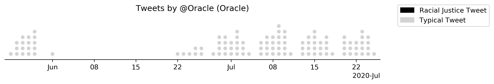
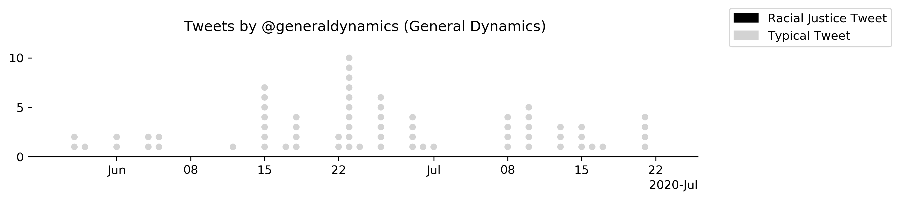
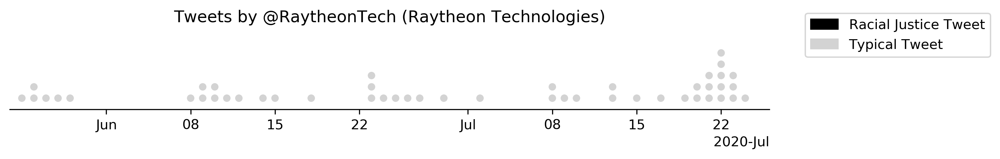

## Silent companies

### List

There were 20 corporations that did not tweet about the protests: [1](#1)

| Corporation | Sector |
| --- | --- |
|Raytheon Technologies|Aerospace & Defense|
|Boeing|Aerospace & Defense|
|Lockheed Martin|Aerospace & Defense|
|Northrop Grumman|Aerospace & Defense|
|General Dynamics|Aerospace & Defense|
|Phillips 66|Energy|
|Valero Energy|Energy|
|Exxon Mobil|Energy|
|Energy Transfer|Energy|
|New York Life Insurance|Financials|
|StoneX|Financials|
|Progressive|Financials|
|Publix Super Markets|Food & Drug Stores|
|Centene|Health Care|
|General Electric|Industrials|
|Ford Motor|Motor Vehicles & Parts|
|Best Buy|Retailing|
|Oracle|Technology|
|HP|Technology|
|Charter Communications|Telecommunications|


### Summary
Some Fortune 100 companies stayed quiet about the protests on Twitter, either pretending they weren't happening at all, or stopping tweeting entirely, only to begin again a few weeks later. 

Perhaps the company that best represents this trend is Oracle, who promptly stopped tweeting after protests began only to return a few weeks later, not mentioning the protests. Oracle has made no statement elsewhere in response to the protests. 



Lorem ipsum dolor sit amet, consectetur adipisicing elit. Facilis veritatis totam commodi, repellendus cum, eum, et repudiandae voluptatem rem tempore ratione deserunt iste maiores dolore iure nisi assumenda officiis laborum! Lorem ipsum dolor sit amet consectetur adipisicing elit. Facilis quibusdam ipsa exercitationem cupiditate tenetur placeat unde molestias voluptates ipsum repellat, velit magni beatae itaque? Molestias beatae adipisci pariatur, nisi nobis.

Lorem, ipsum dolor sit, amet consectetur adipisicing elit. Eaque ut ipsam corrupti quod pariatur repudiandae ad nesciunt, deleniti dolorem nostrum neque, magnam recusandae veniam tempore quis fugit architecto delectus ipsa. Lorem ipsum dolor sit, amet consectetur adipisicing elit. Corporis velit labore dolorum, repellat voluptatem ipsam ex eligendi harum! Saepe obcaecati eligendi deleniti, quas modi aliquam magni, corporis amet! Odit, asperiores.

### Breakdown

#### Lockheed Martin

#### Northrop Grumman

#### General Dynamics

#### Raytheon Technologies

#### Boeing

#### Valero Energy

#### Phillips 66

#### Energy Transfer

#### Exxon Mobil

#### New York Life Insurance

#### StoneX

#### Progressive

#### Publix Super Markets

#### Centene

#### General Electric

#### Ford Motor

#### Best Buy

#### Oracle

#### HP

#### Charter Communications


### Scripts
#### [1]
```python
# generate table of quiet companies and their sectors
from os.path import join as pjoin
import pandas as pd

DATA_DIR = 'fortune-100-blm-dataset/data'
df_c = pd.read_csv(pjoin(DATA_DIR, 'fortune-100.csv')).dropna()
df_b = pd.read_csv(pjoin(DATA_DIR, 'blm-tweets.csv'), parse_dates=['Datetime'])

silent_companies = [x for x in df_c['Corporation'].tolist() if x not in df_b['Corporation'].unique().tolist()]
for i, row in df_c.sort_values(by='Sector').iterrows():
    if row['Corporation'] in silent_companies:
        print(f"{row['Corporation']}|{row['Sector']}")
```
